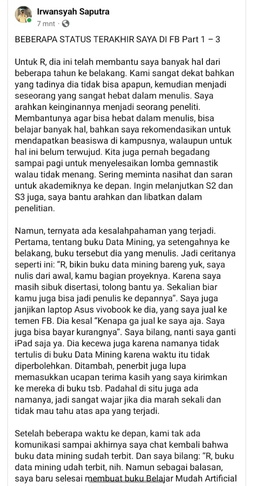
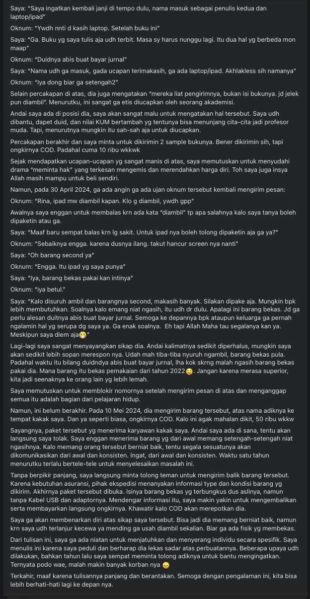

# BAB VI : Awal yang menjadi akhir

Mba R adalah salah satu orang dekat pak I.S sewaktu pak I.S kuliah S3. Mba R melihat isu gorengan yang kian memanas akhirnya ia juga angkat bicara.
[Status Mba R (PUB)](https://www.facebook.com/bibliobookstore/posts/3638480436390737)

Dan mungkin karena panik, entah merasa terpojok oleh gorengan, Pak I.S pun membuat klarifikasi dan ingin berhenti main FB. Tapi orang-orang mulai tidak percaya dan kurang puas dengan tindakan bapak I.S yang kurang bertanggung jawab. Ada 3 part tulisannya:

- [Part 1 (CLOSE)](https://www.facebook.com/Irwansight1/posts/1636196010468479) (**SCREENSHOT / ARCHIVE URGENTLY NEEDED**)
- [Part 2 (CLOSE)](https://www.facebook.com/Irwansight1/posts/1636196147135132) (**SCREENSHOT / ARCHIVE URGENTLY NEEDED**)
- [Part 3 (CLOSE)](https://www.facebook.com/Irwansight1/posts/1636196803801733)

    
Screenshot Part 3

**UPDATE TERBARU:** Pak I.S sepertinya tutup akun.

    
Screenshot Mba R

Screenshot tambahan dari postingan Mba R:

